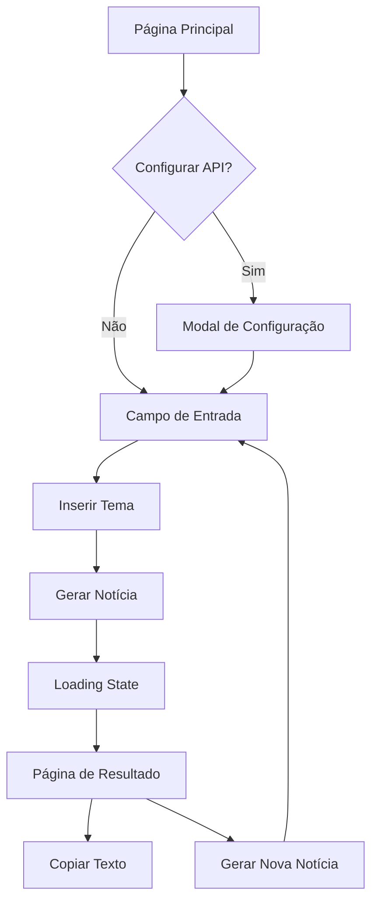

# Simulador de Narrativas - Documento de Requisitos do Produto

## 1. Visão Geral do Produto

O **Gerador de Narrativas** é uma ferramenta educativa inovadora que explora a construção de narrativas jornalísticas e promove a literacia mediática. A plataforma permite aos usuários gerar artigos jornalísticos realistas sobre qualquer tema, demonstrando como narrativas convincentes podem ser construídas.

- **Propósito**: Educar sobre propaganda, construção de narrativas e desenvolver pensamento crítico sobre mídia
- **Público-alvo**: Estudantes, educadores, pesquisadores e profissionais interessados em literacia mediática
- **Valor de mercado**: Ferramenta única que combina IA avançada com propósito educativo sobre desinformação

## 2. Funcionalidades Principais

### 2.1 Papéis de Usuário

| Papel | Método de Acesso | Permissões Principais |
|-------|------------------|----------------------|
| Usuário Padrão | Acesso direto ao site | Pode gerar narrativas com chave de demonstração (limitada) |
| Usuário Premium | Inserção de chave API própria | Uso ilimitado com chave pessoal do Google AI Studio |

### 2.2 Módulos de Funcionalidade

Nosso simulador de narrativas consiste nas seguintes páginas principais:

1. **Página Principal**: campo de entrada de tema, botão de geração, configuração de API
2. **Modal de Configuração**: inserção e gerenciamento da chave API do usuário
3. **Página de Resultado**: exibição do artigo gerado, opções de cópia e nova geração

### 2.3 Detalhes das Páginas

| Nome da Página | Nome do Módulo | Descrição da Funcionalidade |
|----------------|----------------|-----------------------------|
| Página Principal | Cabeçalho | Exibir título "Gerador de Narrativas" e subtítulo explicativo sobre o experimento |
| Página Principal | Campo de Entrada | Capturar tema do usuário com placeholder "Insira um tema absurdo. Ex: 'Descoberta de uma nova cor primária'" |
| Página Principal | Botão de Geração | Acionar geração de narrativa com estado de loading neomórfico |
| Página Principal | Ícone de Configuração | Abrir modal de configuração da API no canto superior direito |
| Modal de Configuração | Formulário de API | Inserir, validar e salvar chave API do Google AI Studio no localStorage |
| Modal de Configuração | Link Externo | Direcionar usuário para Google AI Studio para obter chave API |
| Página de Resultado | Artigo Formatado | Exibir narrativa gerada em formato jornalístico profissional |
| Página de Resultado | Ações do Artigo | Copiar texto para clipboard e gerar nova narrativa |

## 3. Processo Principal

**Fluxo do Usuário Padrão:**
1. Usuário acessa a página principal
2. Opcionalmente configura sua chave API via modal
3. Insere tema desejado no campo de entrada
4. Clica em "Gerar Notícia" e aguarda processamento
5. Visualiza artigo gerado em formato jornalístico
6. Pode copiar o texto ou gerar nova narrativa

## 4. Design da Interface do Usuário

### 4.1 Estilo de Design

- **Cores Primárias**: Fundo monocromático #E0E5EC, elementos da mesma cor diferenciados por sombras
- **Cor de Destaque**: Azul cobalto #2563EB para botão principal e links
- **Estilo de Botão**: Neomórfico com sombras internas e externas suaves
- **Tipografia**: Inter ou Manrope, sans-serif, tamanhos 16px (corpo), 24px (títulos), 32px (título principal)
- **Layout**: Minimalista, focado, sem distrações, elementos centralizados
- **Ícones**: Estilo outline minimalista, emoji ⚙️ para configurações

### 4.2 Visão Geral do Design das Páginas

| Nome da Página | Nome do Módulo | Elementos de UI |
|----------------|----------------|----------------|
| Página Principal | Cabeçalho | Título em Inter 32px, subtítulo em 18px, cor #374151, centralizado |
| Página Principal | Campo de Entrada | Input neomórfico 400px largura, padding 16px, sombra interna sutil |
| Página Principal | Botão Principal | Neomórfico azul cobalto, 200px largura, hover com elevação, loading com anel pulsante |
| Página Principal | Ícone Configuração | Posição absolute top-right, hover com sombra, transição suave |
| Modal de Configuração | Container | Overlay escuro 50% opacidade, modal centralizado com sombra profunda |
| Modal de Configuração | Formulário | Input similar ao principal, botão secundário, link externo destacado |
| Página de Resultado | Artigo | Tipografia jornalística, espaçamento 1.6, largura máxima 800px |
| Página de Resultado | Botões de Ação | Estilo secundário neomórfico, dispostos horizontalmente com gap |

### 4.3 Responsividade

O produto é desktop-first com adaptação mobile completa. Otimização para touch em dispositivos móveis com botões maiores (min 44px) e espaçamento adequado. Layout responsivo com breakpoints em 768px e 1024px.