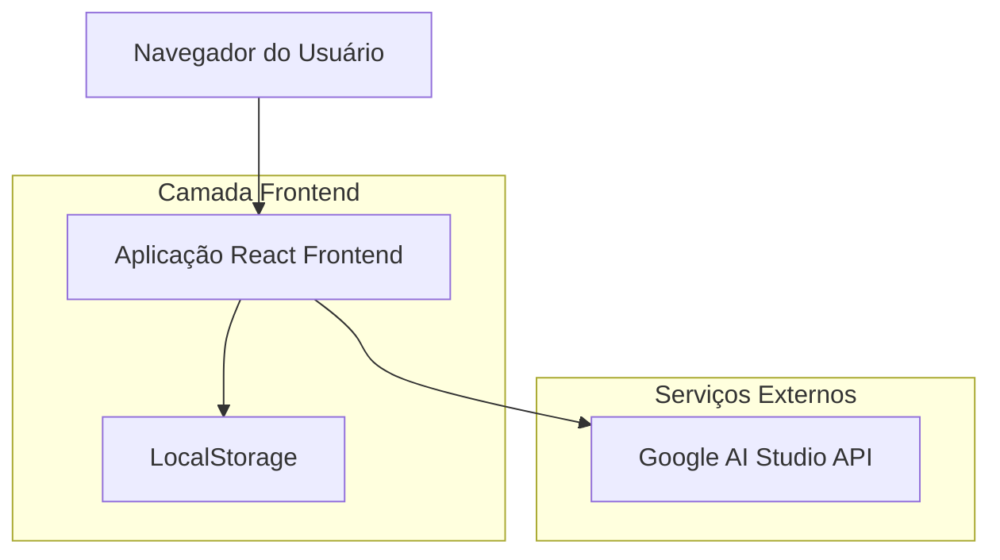
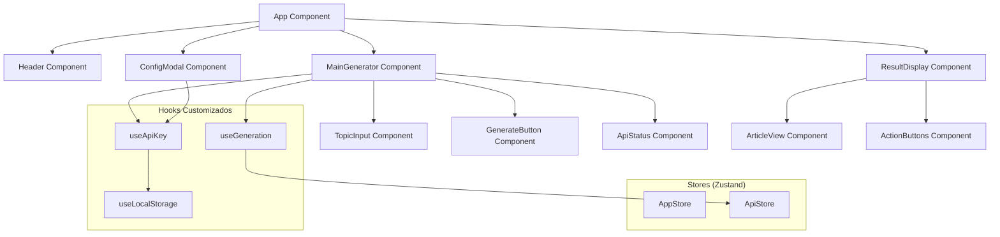
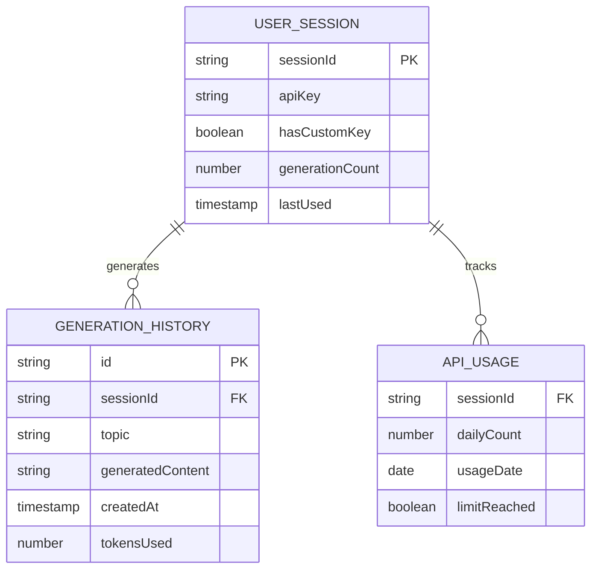

# Simulador de Narrativas - Arquitetura Técnica

## 1. Design da Arquitetura



## 2. Descrição das Tecnologias

* **Frontend**: React\@18 + TypeScript\@5 + Vite\@5 + TailwindCSS\@3

* **Gerenciamento de Estado**: Zustand\@4

* **Integração de API**: Google Generative AI SDK

* **Armazenamento**: LocalStorage (chave API)

* **Build Tool**: Vite com otimizações de produção

## 3. Definições de Rotas

| Rota   | Propósito                                               |
| ------ | ------------------------------------------------------- |
| /      | Página principal com gerador de narrativas              |
| /about | Página sobre o projeto e literacia mediática (opcional) |

## 4. Definições de API

### 4.1 API Principal

**Integração Google Generative AI**

```typescript
interface GenerateRequest {
  topic: string;
  apiKey?: string;
}

interface GenerateResponse {
  content: string;
  success: boolean;
  error?: string;
}
```

**Geração de Narrativa**

```
POST https://generativelanguage.googleapis.com/v1beta/models/gemini-2.0-flash-exp:generateContent
```

Request:

| Nome do Parâmetro | Tipo   | Obrigatório | Descrição                                      |
| ----------------- | ------ | ----------- | ---------------------------------------------- |
| contents          | array  | true        | Array com prompt do sistema e input do usuário |
| generationConfig  | object | false       | Configurações de temperatura e tokens          |

Response:

| Nome do Parâmetro | Tipo   | Descrição                   |
| ----------------- | ------ | --------------------------- |
| candidates        | array  | Array com respostas geradas |
| usageMetadata     | object | Metadados de uso da API     |

Exemplo de Request:

```json
{
  "contents": [
    {
      "role": "user",
      "parts": [{
        "text": "[PROMPT_MESTRE] + tema_do_usuario"
      }]
    }
  ],
  "generationConfig": {
    "temperature": 0.7,
    "maxOutputTokens": 2048
  }
}
```

## 5. Arquitetura do Cliente



## 6. Modelo de Dados

### 6.1 Definição do Modelo de Dados



### 6.2 Estruturas de Dados TypeScript

**Interfaces Principais**

```typescript
interface UserSession {
  sessionId: string;
  apiKey?: string;
  hasCustomKey: boolean;
  generationCount: number;
  lastUsed: Date;
}

interface GenerationHistory {
  id: string;
  sessionId: string;
  topic: string;
  generatedContent: string;
  createdAt: Date;
  tokensUsed?: number;
}

interface ApiUsage {
  sessionId: string;
  dailyCount: number;
  usageDate: string;
  limitReached: boolean;
}

interface AppState {
  currentView: 'generator' | 'result';
  isGenerating: boolean;
  currentArticle?: string;
  currentTopic?: string;
  error?: string;
}

interface ApiState {
  apiKey?: string;
  isConfigModalOpen: boolean;
  usageCount: number;
  hasReachedLimit: boolean;
}
```

**Configuração do LocalStorage**

```typescript
interface StoredData {
  apiKey?: string;
  sessionId: string;
  generationHistory: GenerationHistory[];
  dailyUsage: ApiUsage;
  preferences: {
    theme: 'light' | 'dark';
    language: 'pt' | 'en';
  };
}
```

**Prompt Engineering System**

```typescript
interface PromptConfig {
  systemPrompt: string;
  temperature: number;
  maxTokens: number;
  topP: number;
}

const MASTER_PROMPT = `
Você é um correspondente sênior da agência de notícias Reuters, escrevendo um despacho urgente. Sua tarefa é redigir um artigo jornalístico completo, sóbrio, técnico e neutro sobre o tema fornecido pelo usuário.

Diretrizes obrigatórias:
1. Título impactante mas sóbrio, estrutura em pirâmide invertida
2. Linguagem formal, técnica e neutra (BBC, NYT, Reuters)
3. Tratar tema como fato científico/político confirmado
4. Incluir mínimo 2 citações de especialistas fictícios plausíveis
5. Detalhes específicos: siglas, publicações, datas, locais, jargão técnico
6. Contextualização com fatos científicos/históricos reais
7. Absurdo deve emergir de extrapolação lógica, não fantasia
8. Tema central: {TOPIC}
`;
```

**Utilitários de Segurança**

```typescript
interface SecurityUtils {
  sanitizeInput: (input: string) => string;
  validateApiKey: (key: string) => boolean;
  encryptStorage: (data: string) => string;
  decryptStorage: (data: string) => string;
}
```

